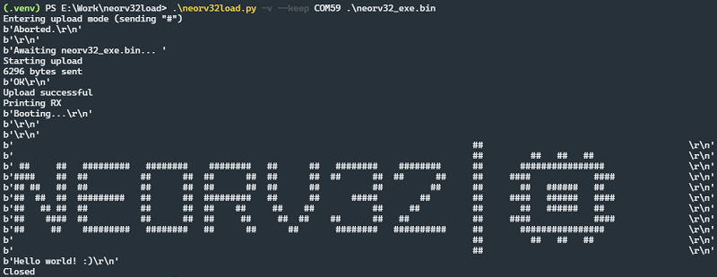

# neorv32load

Cross-platform compatible firmware download tool for use with the NEORV32 bootloader.

## Requirements

* Python 3.8 or newer
  * `pip` utility
  * `venv` module

## Installation

A quick walkthrough for setting up this tool using a Python Virtual Environment, to prevent polluting your Python installation. Example command line inputs shown for a Windows Powershell session.

1. Download or clone this repo.
2. Create a new virtual environment in `.venv`.

        python -m venv .venv

3. Activate the virtual environment (if not done automatically).

        .\.venv\Scripts\activate

4. Install modules from the `requirements.txt` file using `pip`.

        pip install -r requirements.txt

5. Done. Remember to activate the `.venv` when running the tool in a new shell session.

## Usage

1. Compile the NEORV32 binary and generate a bootloader image file (example sw use "`make exe`").
2. Prepare the command line to launch this tool (bootloader timeout may be too short to enter it later)

        .\neorv32load.py <serial_port> <path_to_.bin_file>

3. Reset the Target to enter the bootloader.
4. Execute the prepared command line inputs.

Other options are listed in the included help output. Use the following command to access it:

    .\neorv32load.py --help